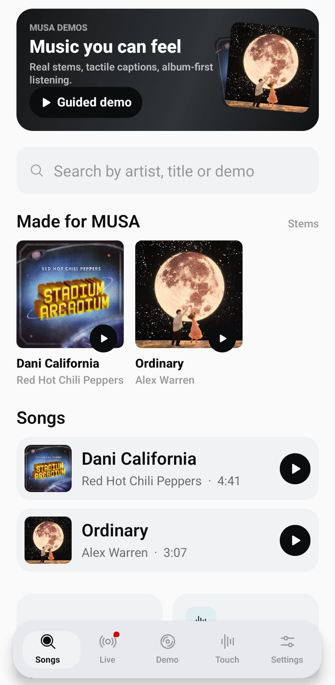
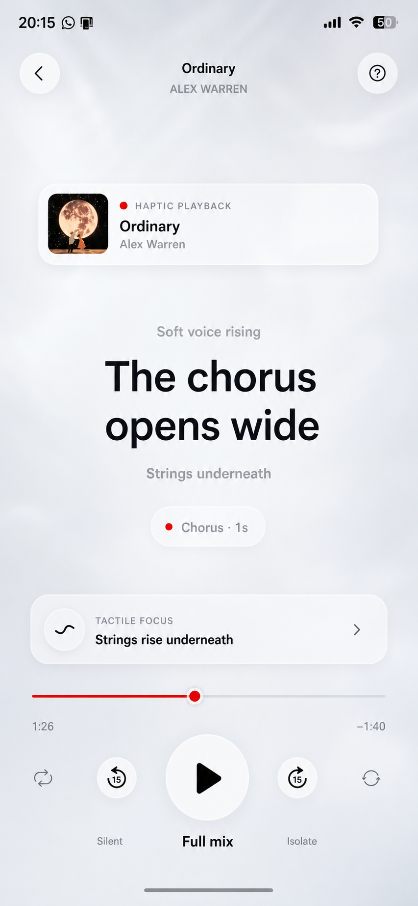

# MUSA - Haptic Captions for Music

> Lyrics you can read. Rhythm you can feel. Music you can follow.

MUSA is a phone-first accessibility layer for music. It turns synced lyrics, song structure, and stem cues into **visual captions plus meaningful haptics**, so a song can be followed through sight, touch, hearing aids, cochlear implants, or the phone alone.

MUSA does not try to replace music. It translates the parts that usually stay hidden in audio: line entrances, silence, sustained phrases, drum attacks, bass body, riff patterns, chorus energy, and live moments before they land.

[Live landing](https://musa-landing-vercel.vercel.app) · [GitHub](https://github.com/MauroProto/musa) · [Musicathon](https://www.musixmatch.com/pro/api/musicathon) · [Rules](https://www.musixmatch.com/pro/api/musicathon/rules)

<p align="center">
  
</p>

## Demo Videos

The landing uses short looped videos to show how MUSA feels in motion. They are stored in `public/` and are also available from the public landing deployment.

| Moment | Video |
| --- | --- |
| Guided score and haptic captions | [Watch MP4](https://musa-landing-vercel.vercel.app/musa-scroll-1.mp4) |
| Haptic language and readable rhythm | [Watch MP4](https://musa-landing-vercel.vercel.app/musa-scroll-2.mp4) |
| Live concert mode | [Watch MP4](https://musa-landing-vercel.vercel.app/musa-scroll-3.mp4) |
| Card demo loop | [Watch MP4](https://musa-landing-vercel.vercel.app/musa-card-1.mp4) |

Local files:

```text
public/musa-scroll-1.mp4
public/musa-scroll-2.mp4
public/musa-scroll-3.mp4
public/musa-card-1.mp4
```

## Screens

<table>
  <tr>
    <td width="33%">
      
    </td>
    <td width="33%">
      
    </td>
    <td width="33%">
      
    </td>
  </tr>
  <tr>
    <td><strong>Demo catalogue</strong><br />Open curated tracks or search a song.</td>
    <td><strong>Guided player</strong><br />Captions, progress, stem cues, and haptics in one flow.</td>
    <td><strong>Phone-first</strong><br />Expo development path for testing on real hardware.</td>
  </tr>
</table>

<table>
  <tr>
    <td width="50%">
      
    </td>
    <td width="50%">
      
    </td>
  </tr>
  <tr>
    <td><strong>A language you can learn</strong><br />Each pattern has a meaning: voice, drums, bass, silence, chorus, and build.</td>
    <td><strong>Live, in the moment</strong><br />MUSA can follow a show and turn stage energy into captions and touch.</td>
  </tr>
</table>

## What It Solves

Most music accessibility stops at lyrics. Lyrics help, but they do not explain when the drums enter, when a chorus is about to hit, when a bass line carries the room, or when a singer holds tension before releasing it.

MUSA adds a **sensory score** on top of a song:

- Large synced captions for readable lyric timing.
- Visual rhythm rails for timing without audio.
- Semantic haptics, not raw vibration.
- Stem-aware cues for drums, bass, guitar, vocals, and chorus moments.
- Calibration so the phone can feel soft, clear, or strong depending on the listener.

The goal is simple: music should not depend on hearing alone.

## How It Works

1. A listener opens a curated demo or searches for a song.
2. MUSA requests synced lyric timing through server-side API routes.
3. Stem cues and authored moments are converted into a deterministic Sensory Score.
4. The player renders readable captions, rhythm state, and haptic events.
5. Native haptics run on phone hardware; web keeps a visual fallback.

The Sensory Score engine is pure and deterministic. It lives outside React and platform APIs so it can be tested directly.

## Hackathon Demo

MUSA was built for **Musicathon 2026** with a judge-facing Android demo.

Recommended demo path:

1. Run the app on a real phone.
2. Open the demo catalogue.
3. Start **Ordinary** or **Dani California** in guided mode.
4. Go to calibration and choose a stronger haptic profile.
5. Press play and hold the phone.
6. Follow the guided chip as the song moves through verse, build, chorus, and instrumental moments.

Demo tracks include:

- **Dani California** - Red Hot Chili Peppers, Musixmatch `trackId = 95574135`.
- **Ordinary** - Alex Warren, stem-backed demo score.

The bundled demo captions are original, non-lyric sensory captions. MUSA does not persist Musixmatch lyrics or subtitles.

## Haptic Language

| Musical event | Haptic idea | What it tells the listener |
| --- | --- | --- |
| Line start | Short tap | A lyric phrase begins. |
| Sustained vocal | Soft long pulse | A voice is being held. |
| Drum attack | Fast crisp pulse | Percussion is driving the beat. |
| Bass body | Lower rolling pulse | The low end is carrying weight. |
| Signature riff | Patterned taps | A recognizable instrumental hook is active. |
| Chorus / drop | Strong bloom | Energy is opening up. |
| Silence / pause | No pulse, visual hold | The song is creating space. |

## Powered By

MUSA uses hackathon sponsor technology as part of the demo workflow:

- [Musixmatch](https://www.musixmatch.com) for synced lyric metadata and Musicathon context.
- [LALAL.AI](https://www.lalal.ai) for stem separation used in demo analysis.

API keys stay server-side only. Do not expose them with `EXPO_PUBLIC_`.

## Team

- [Mauro Protocassina](https://www.linkedin.com/in/mauroprotocassina/)
- [Ignacio Estevo](https://www.linkedin.com/in/ignacio-estevo/)

## Tech Stack

- Expo Router universal app for iOS, Android, and web.
- React Native, React Native Web, and Expo modules.
- `expo-haptics` for native phone feedback.
- `navigator.vibrate` fallback on supported web browsers.
- Expo API routes for server-side Musixmatch and LALAL.AI access.
- Node test runner for deterministic Sensory Score tests.

## Run Locally

Install dependencies:

```bash
npm install
```

Create local environment variables:

```bash
cp .env.example .env
```

Add server-side keys when available:

```bash
MUSIXMATCH_API_KEY=...
LALAL_API_KEY=...
```

Start Expo:

```bash
npm run web
```

For phone testing:

```bash
npx expo start --host lan --clear
```

Then scan the Expo QR code with Expo Go or open the LAN URL from the phone.

## Scripts

```bash
npm run test        # Sensory Score and app logic tests
npm run typecheck   # TypeScript check
npm run lint        # Expo lint
npm run web         # Expo web
npm run ios         # Expo iOS
npm run android     # Expo Android
```

## Project Map

```text
src/app/                 Expo Router screens and API routes
src/app/api/             Server-side API routes
src/lib/sensory-score.ts Pure sensory score engine
src/lib/haptics.ts       Native/web haptic controller
src/lib/demo-guided.ts   Guided demo captions and moments
src/hooks/               Player and stem audio hooks
assets/images/           README, landing, app, and demo imagery
assets/lalalai/          Permissioned hackathon demo stem assets
public/                  Landing demo videos
docs/HANDOFF.md          Demo handoff and manual QA notes
```

## Rules And Constraints

- Never commit `.env`.
- Never put API keys in `EXPO_PUBLIC_` variables.
- Never import server-only API helpers into client screens, components, or hooks.
- Do not persist Musixmatch lyrics or subtitles.
- Keep `src/lib/sensory-score.ts` pure and deterministic.
- Use `src/lib/haptics.ts` for haptic playback.
- Demo stem assets are included only for the MUSA hackathon/demo context and should not be reused or redistributed outside that scope.

## Verification

Before shipping changes:

```bash
npm run test
npm run typecheck
npm run lint
```

The most important manual check is on a real phone: web is useful for layout, but haptic quality needs native hardware.
